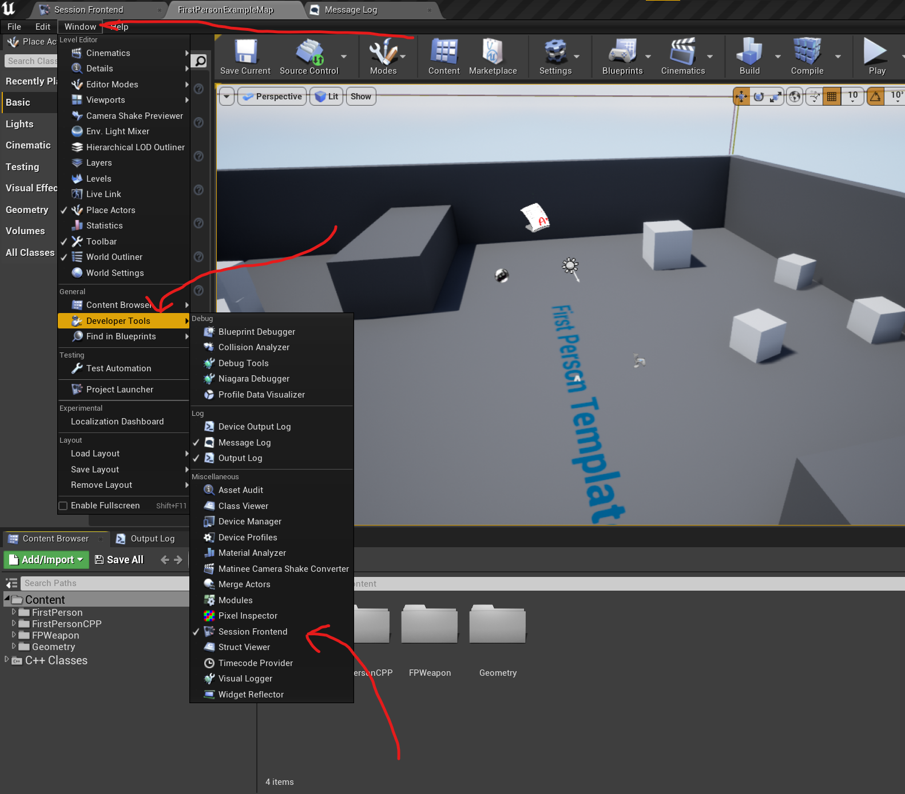
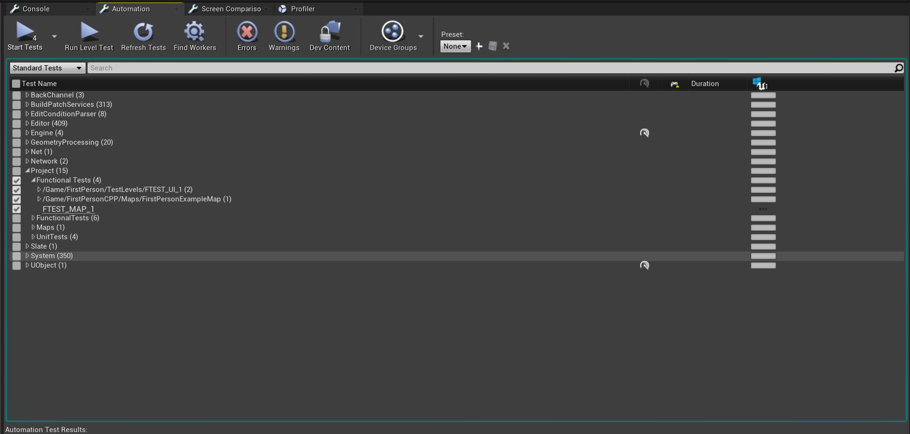

# Unreal Engine 4 Testing
 *This is project to showcase some testing technics in Unreal Engine 4*

## How to test?
Open Session Frontend

Pick automation Tab and check tests:

## Tests:
**Someting like unit test:**

* `Source\AutomatedTests\Enemy\Tests\HealthAndResistanceTest.cpp`

**Functional Test:**
* `Source\AutomatedTests\FunctionalTests\BloaterTest.cpp`

**Functional Test using specs:**
* `Source\AutomatedTests\FunctionalTests\BloaterTest.spec.cpp`

**BP Test:**
* `Game/FirstPersonCPP/Blueprints/FunctionalTest`

**UI Screen Shoot Test**

* `/Game/FirstPerson/Widgets/Tests/FailScreenTest`
* `/Game/FirstPerson/Widgets/Tests/SuccessScreenTest`